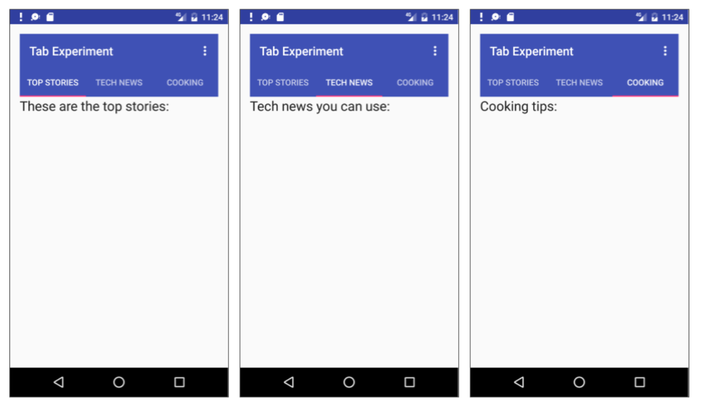

# **SatSet App**

  


```
Nama    : Dipca Anugrah
NIM     : 312210666
Kelas   : TI.22.A.4
Matkul  : Pemrograman Mobile 1
Dosen   : Donny Maulana, S.Kom., M.M.S.I.
```
# **Daftar Isi**
- **[Tugas 1](#tugas-1)**

- **[Tugas 2](#tugas-2)**

- **[Tugas 3](#tugas-3)**

- **[Penjelasan & Hasil Program Tugas 1](#penjelasan--hasil-program-tugas-1)**

- **[Penjelasan & Hasil Program Tugas 2](#penjelasan--hasil-program-tugas-2)**

- **[Penjelasan & Hasil Program Tugas 3](#penjelasan--hasil-program-tugas-3)**

- **[Demo Tugas 1](#demo-program-tugas-1)**

- **[Demo Tugas 2](#demo-program-tugas-2)**

- **[Demo Tugas 3](#demo-program-tugas-3)**

## **Tugas 1**
Buatkanlah :

1. Launcher Splash logo masing-masing Individu 

2. Buatkanlah untuk menampilkan semua project sebelum UTS dengan metode Ekplisit Intent dan

     Implisit Intent:

    a. Project Hallo

    b. Project Count

    c. Project Sianida

    d. Project TwoActivity

    e. Project Set Alarm

Untuk tampilan Layout Bebas, terima kasih.

## **Tugas 2**
Buatlah tampilan menu Versi 02 dari project-project yang sudah dibuat sebelumnya 

dengan tambahan memanggil method Maps

dengan tampilan sebagai berikut :

 
## **Tugas 3**

Buatlah fragment menu dengan tema Genre Film (Action, Komedi dan Romance)

tampilan bisa berisi sinopsis film dan gambar dari film tersebut

contoh seperti ini :



## **Penjelasan & Hasil Program Tugas 1**
Membuat Menu untuk menampilkan semua project, disini saya terdapat 6 project. Berikut adalah kode program pada java dan layout xml.

- **SplashActivity.java**
Program di atas adalah `SplashActivity`, yang berfungsi sebagai tampilan pengantar (splash screen) untuk aplikasi. Di bawah ini adalah penjelasan untuk setiap bagian program:

    1. **`onCreate`**: Metode ini dipanggil saat aktivitas dibuat. Di sini, tata letak aktivitas diinisialisasi dengan menggunakan layout dari file XML `activity_splash.xml`. Selain itu, status bar (bilah notifikasi) diatur untuk disembunyikan sehingga splash screen dapat menutupi seluruh layar.

    ```java
    View decorView = getWindow().getDecorView();
    decorView.setSystemUiVisibility(View.SYSTEM_UI_FLAG_FULLSCREEN);
    ```

    2. **Penundaan dan Pindah ke `MenuActivity`**:
    - Menerapkan penundaan menggunakan objek `Handler` untuk menunda pindah ke `MenuActivity` selama 3 detik (sesuai dengan nilai `SPLASH_DELAY`).
    - Setelah penundaan, objek `Intent` dibuat untuk memulai `MenuActivity`.
    - `startActivity(intent)` memulai aktivitas baru berdasarkan intent yang diberikan.
    - Opsional: `finish()` digunakan untuk menutup `SplashActivity` setelah membuka `MenuActivity`, sehingga pengguna tidak dapat kembali ke splash screen menggunakan tombol "Back".

        ```java
        new Handler().postDelayed(new Runnable() {
            @Override
            public void run() {
                Intent intent = new Intent(SplashActivity.this, MenuActivity.class);
                startActivity(intent);
                finish(); // Optional: ditambahkan untuk menutup SplashActivity setelah membuka MenuActivity
            }
        }, SPLASH_DELAY);
        ```

    Dengan cara ini, `SplashActivity` bertindak sebagai tampilan pembuka yang memberikan kesan singkat sebelum pengguna melihat layar utama (`MenuActivity`). Penundaan memberikan waktu singkat untuk menampilkan merek atau elemen desain yang mewakili aplikasi sebelum memasuki pengalaman pengguna utama.


- **activity_splash.xml**              


- **MenuActivity.java**
Program di atas adalah `MenuActivity` yang bertindak sebagai pengontrol untuk layar menu utama aplikasi. Berikut adalah penjelasan untuk setiap fungsi dalam program tersebut:

    1. **`onCreate`**: Metode ini dipanggil saat aktivitas  dibuat. Di sini, tata letak aktivitas diinisialisasi dengan menggunakan layout dari file XML `activity_menu.xml`. Selain itu, enam `CardView` yang mewakili menu aplikasi diinisialisasi.

        ```java
        @Override
        protected void onCreate(Bundle savedInstanceState) {
            super.onCreate(savedInstanceState);
            setContentView(R.layout.activity_menu);

            // Inisialisasi CardView untuk setiap tombol menu
            tombolSatu = findViewById(R.id.cdMenu1);
            tombolDua = findViewById(R.id.cdMenu2);
            tombolTiga = findViewById(R.id.cdMenu3);
            tombolEmpat = findViewById(R.id.cdMenu4);
            tombolLima = findViewById(R.id.cdMenu5);
            tombolEnam = findViewById(R.id.cdMenu6);
        }
        ```

    2. **Tombol Menu 1 (`tombolSatu`)**:
    - Ketika `tombolSatu` ditekan, sebuah objek `Intent` dibuat untuk memulai `HelloActivity`.
    - Metode `startActivity(intent)` memulai aktivitas baru berdasarkan intent yang diberikan.

        ```java
        tombolSatu.setOnClickListener(new View.OnClickListener() {
            @Override
            public void onClick(View v) {
                Intent intent = new Intent(MenuActivity.this, HelloActivity.class);
                startActivity(intent);
            }
        });
        ```

    3. **Tombol Menu 2 sampai Menu 6**:
    - Setiap tombol menu lainnya (`tombolDua` hingga `tombolEnam`) memiliki logika yang serupa dengan `tombolSatu`.
    - Mereka memiliki fungsi `setOnClickListener` yang membuat objek `Intent` untuk memulai aktivitas yang sesuai ketika tombol ditekan.

        ```java
        tombolDua.setOnClickListener(new View.OnClickListener() {
            @Override
            public void onClick(View v) {
                Intent intent = new Intent(MenuActivity.this, MainActivity.class);
                startActivity(intent);
            }
        });
        ```

    Dengan cara ini, `MenuActivity` berfungsi sebagai pemandu untuk memulai berbagai aktivitas dalam aplikasi saat tombol-tombol menu yang sesuai ditekan.
    Berikut adalah penjelasan untuk setiap fungsi dalam kelas `MenuActivity`.


- **activity_menu.xml**

    disini saya tidak menampilkan kode programnya karna panjang, saya akan menampilkan design dan component apa saja yang digunakan.

     

      

     

Sumber icon -->
[www.flaticon.com](https://www.flaticon.com/)


## **Penjelasan Program Tugas 2**
- **MenuActivity.java**

    Program di atas adalah implementasi dari sebuah `MenuActivity` dalam aplikasi Android menggunakan bahasa pemrograman Java. Berikut adalah penjelasan beberapa aspek dari program tersebut:

    1. **Package dan Imports:**
        ```java
        package androidx.constraintlayout.widget.satset;
        ```

        Package yang mengandung kelas `MenuActivity`.

        ```java
        import android.content.Intent;
        import android.os.Bundle;
        import android.view.View;
        import android.widget.LinearLayout;
        import androidx.appcompat.app.AppCompatActivity;
        import androidx.constraintlayout.widget.FragmentMovie.MainFragment;
        import androidx.constraintlayout.widget.Second.OneActivity;
        ```

        Import beberapa kelas dan paket yang digunakan dalam program, seperti `Intent`, `Bundle`, `View`, `LinearLayout`, `AppCompatActivity`, `MainFragment`, dan `OneActivity`.

    2. **Deklarasi dan Inisialisasi Variabel:**
        ```java
        public class MenuActivity extends AppCompatActivity {
            LinearLayout tombolSatu;
            LinearLayout tombolDua;
            // ... (variabel untuk tombol 3 hingga tombol 9)
        ```

        Pendeklarasian variabel `LinearLayout` untuk tombol-tombol menu.

    3. **Method `onCreate`:**
        ```java
        @Override
        protected void onCreate(Bundle savedInstanceState) {
            super.onCreate(savedInstanceState);
            setContentView(R.layout.activity_menu);

            View decorView = getWindow().getDecorView();
            decorView.setSystemUiVisibility(View.SYSTEM_UI_FLAG_FULLSCREEN);
        ```

        Metode `onCreate` dipanggil saat aktivitas dibuat. Pada metode ini, layout dari `activity_menu` diatur sebagai tata letak utama dan flag `SYSTEM_UI_FLAG_FULLSCREEN` ditetapkan untuk menyembunyikan bilah status dan navigasi.

    4. **OnClickListener untuk Tombol-tombol Menu:**
        ```java
        tombolSatu = findViewById(R.id.cdMenu1);
        tombolSatu.setOnClickListener(new View.OnClickListener() {
            @Override
            public void onClick(View v) {
                Intent intent = new Intent(MenuActivity.this, HelloActivity.class);
                startActivity(intent);
            }
        });

        // ... (implementasi onClickListener untuk tombol 2 hingga tombol 9)
        ```

        Masing-masing tombol menu memiliki pendengar klik (`OnClickListener`) yang akan memulai aktivitas baru tergantung pada tombol yang diklik. Misalnya, tombolSatu akan memulai `HelloActivity` saat diklik.

    5. **Metode `setAlarm`:**
        ```java
        private void setAlarm() {
            Intent alarm = new Intent(android.provider.AlarmClock.ACTION_SET_ALARM);
            startActivity(alarm);
        }
        ```

        Sebuah metode pribadi (`private`) yang disebut `setAlarm`, yang membuat objek `Intent` untuk memicu aplikasi Jam Alarm bawaan sistem dan memulai aktivitas tersebut.

        Program ini menyajikan antarmuka menu yang terdiri dari tombol-tombol yang, saat diklik, akan memulai aktivitas tertentu atau menjalankan fungsi tertentu seperti menetapkan alarm.

- **activity_menu.xml**

    ```xml
        <?xml version="1.0" encoding="utf-8"?>
        <RelativeLayout xmlns:android="http://schemas.android.com/apk/res/android"
            xmlns:app="http://schemas.android.com/apk/res-auto"
            xmlns:tools="http://schemas.android.com/tools"
            android:layout_width="match_parent"
            android:layout_height="match_parent"
            android:background="@drawable/img"
            android:visibility="visible"
            tools:context=".MenuActivity">


            <LinearLayout
                android:layout_width="match_parent"
                android:layout_height="match_parent"
                android:layout_marginLeft="16dp"
                android:layout_marginTop="140dp"
                android:layout_marginRight="16dp"
                android:orientation="vertical">

                <ImageView
                    android:id="@+id/imageView"
                    android:layout_width="150dp"
                    android:layout_height="75dp"
                    android:layout_gravity="center"
                    android:layout_marginBottom="10dp"
                    android:background="@drawable/satsettextlogo"
                    android:backgroundTint="#FFFFFF" />

                <LinearLayout
                    android:layout_width="match_parent"
                    android:layout_height="150dp"
                    android:layout_margin="5dp"
                    android:orientation="horizontal">

                    <LinearLayout
                        android:id="@+id/cdMenu1"
                        android:layout_width="107dp"
                        android:layout_height="match_parent"
                        android:background="@drawable/bg_card_view"
                        android:orientation="vertical">

                        <ImageView
                            android:id="@+id/imageView1"
                            android:layout_width="match_parent"
                            android:layout_height="wrap_content"
                            android:layout_margin="16dp"
                            android:layout_weight="1"
                            app:srcCompat="@drawable/hello2" />

                        <TextView
                            android:id="@+id/textView1"
                            android:layout_width="match_parent"
                            android:layout_height="wrap_content"
                            android:fontFamily="serif"
                            android:text="Hello"
                            android:textAlignment="center"
                            android:textColor="@color/white"
                            android:textSize="18dp"
                            android:textStyle="bold" />

                    </LinearLayout>

                    <LinearLayout
                        android:id="@+id/cdMenu2"
                        android:layout_width="107dp"
                        android:layout_height="match_parent"
                        android:background="@drawable/bg_card_view"
                        android:orientation="vertical">

                        <ImageView
                            android:id="@+id/imageView2"
                            android:layout_width="match_parent"
                            android:layout_height="wrap_content"
                            android:layout_margin="16dp"
                            android:layout_weight="1"
                            app:srcCompat="@drawable/calculators" />

                        <TextView
                            android:id="@+id/textView2"
                            android:layout_width="match_parent"
                            android:layout_height="wrap_content"
                            android:fontFamily="serif"
                            android:text="Count"
                            android:textAlignment="center"
                            android:textColor="@color/white"
                            android:textSize="18dp"
                            android:textStyle="bold" />
                    </LinearLayout>

                    <LinearLayout
                        android:id="@+id/cdMenu3"
                        android:layout_width="107dp"
                        android:layout_height="match_parent"
                        android:background="@drawable/bg_card_view"
                        android:orientation="vertical">

                        <ImageView
                            android:id="@+id/imageView3"
                            android:layout_width="match_parent"
                            android:layout_height="wrap_content"
                            android:layout_margin="16dp"
                            android:layout_weight="1"
                            app:srcCompat="@drawable/googlemaps" />

                        <TextView
                            android:id="@+id/textView3"
                            android:layout_width="match_parent"
                            android:layout_height="wrap_content"
                            android:fontFamily="serif"
                            android:text="Maps"
                            android:textAlignment="center"
                            android:textColor="@color/white"
                            android:textSize="18dp"
                            android:textStyle="bold" />
                    </LinearLayout>

                </LinearLayout>

                <LinearLayout
                    android:layout_width="match_parent"
                    android:layout_height="150dp"
                    android:layout_margin="5dp"
                    android:orientation="horizontal">

                    <LinearLayout
                        android:id="@+id/cdMenu4"
                        android:layout_width="107dp"
                        android:layout_height="match_parent"
                        android:background="@drawable/bg_card_view"
                        android:orientation="vertical">

                        <ImageView
                            android:id="@+id/imageView4"
                            android:layout_width="match_parent"
                            android:layout_height="wrap_content"
                            android:layout_margin="16dp"
                            android:layout_weight="1"
                            app:srcCompat="@drawable/news" />

                        <TextView
                            android:id="@+id/textView4"
                            android:layout_width="match_parent"
                            android:layout_height="wrap_content"
                            android:fontFamily="serif"
                            android:text="News"
                            android:textAlignment="center"
                            android:textColor="@color/white"
                            android:textSize="18dp"
                            android:textStyle="bold" />
                    </LinearLayout>

                    <LinearLayout
                        android:id="@+id/cdMenu5"
                        android:layout_width="107dp"
                        android:layout_height="match_parent"
                        android:background="@drawable/bg_card_view"
                        android:orientation="vertical">

                        <ImageView
                            android:id="@+id/imageView5"
                            android:layout_width="match_parent"
                            android:layout_height="wrap_content"
                            android:layout_margin="16dp"
                            android:layout_weight="1"
                            app:srcCompat="@drawable/alarmclock" />

                        <TextView
                            android:id="@+id/textView5"
                            android:layout_width="match_parent"
                            android:layout_height="wrap_content"
                            android:fontFamily="serif"
                            android:text="Alarm"
                            android:textAlignment="center"
                            android:textColor="@color/white"
                            android:textSize="18dp"
                            android:textStyle="bold" />
                    </LinearLayout>

                    <LinearLayout
                        android:id="@+id/cdMenu6"
                        android:layout_width="107dp"
                        android:layout_height="match_parent"
                        android:background="@drawable/bg_card_view"
                        android:orientation="vertical">

                        <ImageView
                            android:id="@+id/imageView6"
                            android:layout_width="match_parent"
                            android:layout_height="wrap_content"
                            android:layout_margin="16dp"
                            android:layout_weight="1"
                            app:srcCompat="@drawable/axis" />

                        <TextView
                            android:id="@+id/textView6"
                            android:layout_width="match_parent"
                            android:layout_height="wrap_content"
                            android:fontFamily="serif"
                            android:text="Fibonaci"
                            android:textAlignment="center"
                            android:textColor="@color/white"
                            android:textSize="18dp"
                            android:textStyle="bold" />
                    </LinearLayout>

                </LinearLayout>

                <LinearLayout
                    android:layout_width="match_parent"
                    android:layout_height="150dp"
                    android:layout_margin="5dp"
                    android:orientation="horizontal">

                    <LinearLayout
                        android:id="@+id/cdMenu7"
                        android:layout_width="107dp"
                        android:layout_height="match_parent"
                        android:background="@drawable/bg_card_view"
                        android:orientation="vertical">

                        <ImageView
                            android:id="@+id/imageView7"
                            android:layout_width="match_parent"
                            android:layout_height="wrap_content"
                            android:layout_margin="16dp"
                            android:layout_weight="1"
                            app:srcCompat="@drawable/chat1" />

                        <TextView
                            android:id="@+id/textView7"
                            android:layout_width="match_parent"
                            android:layout_height="wrap_content"
                            android:fontFamily="serif"
                            android:text="Chat"
                            android:textAlignment="center"
                            android:textColor="@color/white"
                            android:textSize="18dp"
                            android:textStyle="bold" />
                    </LinearLayout>

                    <LinearLayout
                        android:id="@+id/cdMenu8"
                        android:layout_width="107dp"
                        android:layout_height="match_parent"
                        android:background="@drawable/bg_card_view"
                        android:orientation="vertical">

                        <ImageView
                            android:id="@+id/imageView8"
                            android:layout_width="match_parent"
                            android:layout_height="wrap_content"
                            android:layout_margin="16dp"
                            android:layout_weight="1"
                            app:srcCompat="@drawable/videocamera" />

                        <TextView
                            android:id="@+id/textView8"
                            android:layout_width="match_parent"
                            android:layout_height="wrap_content"
                            android:fontFamily="serif"
                            android:text="Movies"
                            android:textAlignment="center"
                            android:textColor="@color/white"
                            android:textSize="18dp"
                            android:textStyle="bold" />
                    </LinearLayout>

                    <LinearLayout
                        android:id="@+id/cdMenu9"
                        android:layout_width="107dp"
                        android:layout_height="match_parent"
                        android:background="@drawable/bg_card_view"
                        android:orientation="vertical">

                        <ImageView
                            android:id="@+id/imageView9"
                            android:layout_width="match_parent"
                            android:layout_height="wrap_content"
                            android:layout_margin="16dp"
                            android:layout_weight="1"
                            app:srcCompat="@drawable/logo_circle" />

                        <TextView
                            android:id="@+id/textView9"
                            android:layout_width="match_parent"
                            android:layout_height="wrap_content"
                            android:fontFamily="serif"
                            android:text="Empty"
                            android:textAlignment="center"
                            android:textColor="@color/white"
                            android:textSize="18dp"
                            android:textStyle="bold" />
                    </LinearLayout>

                </LinearLayout>

            </LinearLayout>

    ```

</RelativeLayout>

- **Menu Versi 02**

     


## **Penjelasan & Hasil Program Tugas 3**
- **Menu Versi 03** 

     

- **MainFragment.java**

    Program di atas adalah implementasi dari sebuah `AppCompatActivity` dalam aplikasi Android yang menggunakan `Fragment` dan `NavigationView` untuk membuat antarmuka aplikasi dengan navigasi lapisan bawah (bottom navigation) dan navigasi lapisan samping (drawer navigation).

    Berikut adalah penjelasan beberapa aspek dari program tersebut:

    1. **Package dan Imports:**
        ```java
        package androidx.constraintlayout.widget.FragmentMovie;
        ```

        Package yang mengandung kelas `MainFragment`.

        ```java
        // ... (existing imports)
        ```

        Import beberapa kelas yang digunakan dalam program, seperti `AppCompatActivity`, `NavigationView`, `Toolbar`, `DrawerLayout`, `FragmentManager`, `FragmentTransaction`, dan beberapa fragment (`HomeFragment`, `ScheduleFragment`, `HistoryFragment`, `ProfilFragment`, `SettingFragment`, `ShareFragment`, `AboutFragment`).

    2. **Deklarasi dan Inisialisasi Variabel:**
        ```java
        public class MainFragment extends AppCompatActivity implements NavigationView.OnNavigationItemSelectedListener {
            private DrawerLayout drawerLayout;
        ```

        Pendeklarasian variabel `DrawerLayout` yang akan digunakan untuk mengatur navigasi lapisan samping.

    3. **Method `onCreate`:**
        ```java
        @Override
        protected void onCreate(Bundle savedInstanceState) {
            super.onCreate(savedInstanceState);
            setContentView(R.layout.nav_main);
        ```

        Metode `onCreate` dipanggil saat aktivitas dibuat. Pada metode ini, layout `nav_main` diatur sebagai tata letak utama.

    4. **Inisialisasi dan Konfigurasi Navigasi Lapisan Samping (Drawer Navigation):**
        ```java
        drawerLayout = findViewById(R.id.drawer_layout);
        NavigationView navigationView = findViewById(R.id.nav_view);
        Toolbar toolbar = findViewById(R.id.toolbar);

        setSupportActionBar(toolbar);
        ActionBarDrawerToggle toggle = new ActionBarDrawerToggle(
                this, drawerLayout, toolbar, R.string.open_nav, R.string.close_nav
        );
        drawerLayout.addDrawerListener(toggle);
        toggle.syncState();
        ```

        Inisialisasi dan konfigurasi elemen-elemen yang terkait dengan navigasi lapisan samping, seperti `DrawerLayout`, `NavigationView`, dan `Toolbar`. `ActionBarDrawerToggle` digunakan untuk menyediakan ikon hamburger dan animasi saat membuka atau menutup drawer.

    5. **Pengecekan Status Instance:**
        ```java
        if (savedInstanceState == null) {
            // Initial fragment setup
            replaceFragment(new HomeFragment(), "HomeFragment");
            navigationView.setCheckedItem(R.id.nav_home);
        }
        ```

        Pengecekan apakah aktivitas dibuat ulang setelah pemulihan instance. Jika tidak, maka setup awal fragment dilakukan dengan menggantikan fragment yang sedang ditampilkan dengan `HomeFragment`.

    6. **Konfigurasi Navigasi Lapisan Bawah (Bottom Navigation):**
        ```java
        BottomNavigationView bottomNavigationView = findViewById(R.id.bottomNavigationView);
        bottomNavigationView.setOnItemSelectedListener(item -> {
            // ... (implementasi pemilihan fragment berdasarkan item yang dipilih)
        });
        ```

        Inisialisasi dan konfigurasi bottom navigation. Pemilihan fragment dilakukan berdasarkan item yang dipilih pada bottom navigation.

    7. **Metode `replaceFragment`:**
        ```java
        private void replaceFragment(Fragment fragment, String tag) {
            FragmentManager fragmentManager = getSupportFragmentManager();
            FragmentTransaction fragmentTransaction = fragmentManager.beginTransaction();

            fragmentTransaction.replace(R.id.frame_layout, fragment, tag);
            fragmentTransaction.commit();
        }
        ```

        Metode pribadi yang digunakan untuk menggantikan fragment yang sedang ditampilkan di dalam frame layout (`R.id.frame_layout`).

    8. **Metode `onNavigationItemSelected`:**
        ```java
        @Override
        public boolean onNavigationItemSelected(@NonNull MenuItem item) {
            // ... (implementasi pemilihan fragment berdasarkan item yang dipilih pada navigation drawer)
        }
        ```

        Metode ini dipanggil saat item dipilih pada navigation drawer. Pemilihan fragment dilakukan berdasarkan item yang dipilih pada drawer navigation.

        Program ini menciptakan antarmuka dengan navigasi lapisan bawah dan samping, yang memungkinkan pengguna memilih fragment melalui bottom navigation atau navigation drawer. Program juga menggunakan toolbar untuk menyediakan akses ke drawer navigation.

## **Demo Program Tugas 1**
https://github.com/dipca0895/SatSet_App/assets/115719283/d97e390b-5c19-4e77-9f9d-92ca369432f3

## **Demo Program Tugas 2**
https://github.com/dipca0895/SatSet_App/assets/115719283/2b1387fe-8941-46a4-93aa-7e26af492d57


## **Demo Program Tugas 3**
https://github.com/dipca0895/SatSet_App/assets/115719283/338b2fdd-a78f-4e59-a8bf-7fa808c6efb7

**Menu Versi 03**

https://github.com/dipca0895/SatSet_App/assets/115719283/732c8eba-6542-4ac7-8e72-69eb46c57539


**[Back--->](#satset-app)**